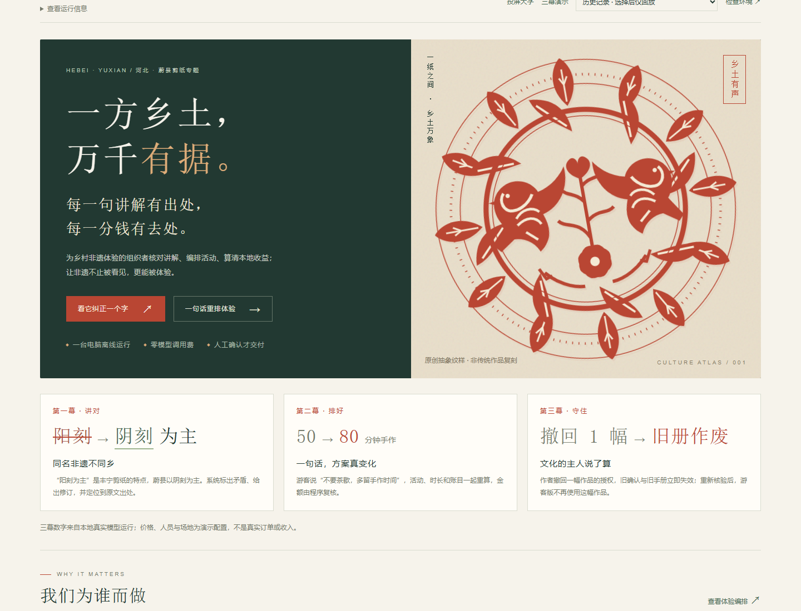
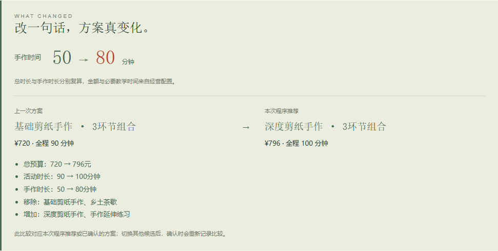

# 乡艺有据

**可信非遗体验编排智能体｜智慧文旅与乡村振兴**

代码仓库：[tingfengy2000-creator/xiangyi-youju](https://github.com/tingfengy2000-creator/xiangyi-youju)（当前为公开仓库；本轮仅核对状态，未更改可见性）。

乡艺有据帮助乡村文旅工作人员，把有来源的非遗资料变成讲解准确、时间与预算可行、村民服务报酬可解释的文化体验方案。首个案例为蔚县剪纸，以丰宁满族剪纸作地域知识对照。

项目面向中国研究生智慧城市技术与创意设计大赛，以争取进入全国决赛为目标。前端视觉品质是最高设计要求，技术和案例围绕可展示、可核对的业务闭环展开。

> **当前阶段：修复自然语言条件与交付可靠性。** 保留原三页和八模块组合，文化事实、经营承诺和用户需求分别处理；手作最低时长与全程上限分开，明确偏好由程序排序，资源不足给出具体缺口。旧六例已转回归并保留首次失败；本轮新输入验收、固定流程对照和可修改输入的演示见 [本轮实测](docs/validation/semantic-reliability-2026-10-03.md)。三个官方模板已有 [申报草案](docs/submission/README.md)，待补项不会写成真实成果。



## 第一次了解项目，从这里开始

| 你想了解什么 | 阅读入口 |
| --- | --- |
| 解决什么问题、为何这样设计 | [产品方案](docs/design/product-plan.md) |
| 做到哪一步、接下来做什么 | [项目进度](docs/progress/project-status.md) |
| 打开真实界面与运行环境 | [本地运行说明](docs/development/local-runtime.md)；本机启动后访问8780端口 |
| 核对真实案例、速度与失败记录 | [本轮分组实测与固定流程对照](docs/validation/semantic-reliability-2026-10-03.md) |
| LLM 和 Agent 如何发挥价值 | [技术架构与验证方案](docs/design/technical-architecture.md) |
| 如何安排开发和参赛展示 | [实施与参赛清单](docs/design/delivery-plan.md) |
| 后续按什么格式提交材料 | [申报正文与原模板草案](docs/submission/README.md) · [附件约束](docs/development/competition-submission.md) |
| 每次交付增加了什么 | [更新记录](CHANGELOG.md) |
| 如何参与开发、管理文件 | [开发说明](CONTRIBUTING.md) · [目录与命名规范](docs/development/repository-conventions.md) |

GitHub 网页显示源码；真实业务在本机启动后访问。直接打开 HTML 只是明确标注的预设模式，不能代替本地模型运行。

## 三个页面，一条业务流程

1. **乡土发现**：认识地方文化，选择体验主题。
2. **可信内容工坊**：定位讲解问题，查看来源和修改建议。
3. **体验与共益**：比较同场地活动组合，现场改偏好、预算和资源；先预览，再人工确认并下载体验包。旧轻/深套餐保留为回归入口。

本轮实现的业务流程：`原文拆解与文字偏好提取 → 冲突时确认 → 地域证据核验 → 活动模块求解与修订 → 教学生成与逐项扫描 → 双版预览 → 人工确认 → 体验包`。

文字可表达“不安排茶歇”“多留手作时间”“手作至少60分钟”、客群及人数/预算/时长；与表单不同会停止并请使用者选择。其它模块可比较程序提供的候选；文字硬性指定其它模块增删、跨场地或新增服务时需澄清，不宣称能理解任意旅游需求。

明确偏好先满足硬约束，再按手作分钟、总价、总时长稳定排序；同一输入不会让模型反复挑错候选。

LLM（大语言模型）负责理解、查证和表达；Agent（能按任务调用工具的程序）安排查证与修订步骤；确定性程序负责金额、容量和时间计算；人负责文化判断、授权及对外使用确认。

本轮真实运行截图：[投屏纠错与证据](docs/assets/screenshots/semantic-studio.png) · [一句话改变方案](docs/assets/screenshots/semantic-comparison.png) · [具体资源冲突](docs/assets/screenshots/semantic-resource-refusal.png) · [双版预览](docs/assets/screenshots/semantic-preview.png)。这些图片来自已保存的实际本地任务，不是效果合成图。



实际输入修改后，手作由50变80分钟，全程由90变100分钟，总价由720变796元；全部为演示测算，不是实际订单。5个真实UI任务覆盖三个演示及确认/拒绝分支，完整记录见[浏览器证据](docs/validation/semantic-browser-2026-10-03.json)。

体验包样张：[游客版](docs/validation/experience-packs/semantic-visitor.html) · [组织者版](docs/validation/experience-packs/semantic-organizer.html)（下载后用浏览器打开；素材撤回后实际模型生成并重新确认的演示快照，不是活动订单）。

## 当前状态

更新日期：**2026-10-03**。详细状态以 [项目进度](docs/progress/project-status.md) 为准。

| 内容 | 状态 | 说明 |
| --- | --- | --- |
| 产品方案、架构、参赛路线 | 已完成本轮设计 | 随后续实现和需求变化修订 |
| 三页高保真业务界面 | 已接通真实后端 | 保留纸白、墨绿、朱红；直接打开HTML仍是明示预设 |
| 八模块候选、账本、资源校验与双版预览/导出 | 已实现 | 整数分复算；程序锁定必要时长、报价、教师、场地；人工确认与版本失效保护 |
| 目录、依赖、中文说明与交付规则 | 已完成整理 | 本仓库作为后续统一交付位置 |
| 本地模型、地域检索、Agent与教学表达 | 已实际运行 | 12个短片段、4个官方页面；支持/矛盾/分歧/不足分开记录；失败保留 |
| 旧六例回归、新24例与固定流程对照 | 本轮小规模内部验证 | 分类统计完整交付、必要确认、正确拒绝；不是第三方评测或通用准确率 |
| 独立人工评审、真实合作及收益 | 待开展 | 不使用虚构成绩或合作信息 |

## 启动真实业务

本机已准备好隔离环境、官方模型与运行器。新增教学与偏好提取会增加调用及耗时，当前速度以 [本轮实测](docs/validation/semantic-reliability-2026-10-03.md) 为准。旧版2—3秒短任务不代表新版完整任务速度。

在本仓库已准备好的隔离环境中运行：

```powershell
.venv\Scripts\python.exe scripts/start_local.py
```

打开 **http://127.0.0.1:8780/**。无需模型 API 密钥。首次在其他电脑使用时，先按 [本地运行说明](docs/development/local-runtime.md) 安装隔离依赖、下载并校验官方模型；不要使用其他项目的 Python 环境。

```powershell
git clone https://github.com/tingfengy2000-creator/xiangyi-youju.git
cd xiangyi-youju
```

只想查看历史设计时，可双击 `frontend/prototype/index.html`。该入口明确使用预设案例。HTTP 模式遇到故障会显示失败，不能悄悄回退成预设结果。

## 开发验证

本轮后端环境为 Python 3.12，浏览器验证需 Node.js 20+。假模型单元测试与实际推理验证分开记录。

```powershell
.venv\Scripts\python.exe scripts/check_repository.py
.venv\Scripts\python.exe -m pytest tests/backend -q
npm ci
npx playwright install chromium
npm test
```

Windows 已安装 Microsoft Edge 时，可使用它验证而省去下载 Chromium：

```powershell
npm ci
$env:BROWSER_CHANNEL = "msedge"
npm test
```

Playwright 是浏览器自动化工具。`npm test` 检查三页、两种屏幕尺寸、活动方案、金额与约束、导出说明；结果写入不纳入 Git 的 `artifacts/test-results/`，不覆盖已审核的文档截图。

## 仓库地图

```text
frontend/prototype/          三页界面、真实API接入及明示预设模式
backend/                     模型、工作流、检索、编排、确认和导出
data/curated/                文化来源和素材使用信息
data/operating/              独立的演示经营配置
docs/design/                 产品方案、技术架构、实施计划
docs/diagrams/               架构图源文件和展示图片
docs/assets/screenshots/     已审核的展示截图
docs/progress/               当前进度和阶段交付记录
docs/validation/             留存的验证证据及适用范围
docs/submission/             官方原模板草案、申报正文与待补项
docs/development/            开发与命名规范
scripts/                    预览、仓库检查、图示维护工具
tests/e2e/                  浏览器交互检查
.github/                    任务与变更说明模板
artifacts/                  本地生成结果，不提交
```

目录和文件默认使用英文小写与连字符，Python 文件采用下划线。`frontend/prototype/` 沿用原有路径，当前同时支持真实业务和明示历史原型；无需为目录改名重写前端。

## 技术路线与费用边界

采用本地 **Qwen3-14B Q4_K_M + Ollama + LangGraph OSS + FastAPI + SQLite**，无需微调、不接付费模型 API。前端保留原生 HTML/CSS/JavaScript 并直接接通业务，没有为实现闭环增加框架迁移。模型调用最多8次，方案修订最多2轮；金额与资源由程序校验。

“免费”指利用已有设备、不新增模型许可和 API 费用；设备、电费和人工维护仍有成本。模型权重、环境、私密数据与密钥不放入 Git。本仓库尚未声明项目整体的开源许可证；第三方模型、资料、框架和素材仍遵循各自许可。

## 后续每次成果如何交付

每次工作都在本仓库中完成，同步进度、相关设计和更新记录；通过相关检查后提交并推送到 GitHub，交付说明附提交号、验证结果和未完成事项。规则见 [AGENTS.md](AGENTS.md) 和 [CONTRIBUTING.md](CONTRIBUTING.md)。

初始版本由此前方案与原型迁入，旧文件夹保留为历史快照。新的方案、代码、正式截图和进度更新以本仓库为准，避免多个文件夹各自演进。
