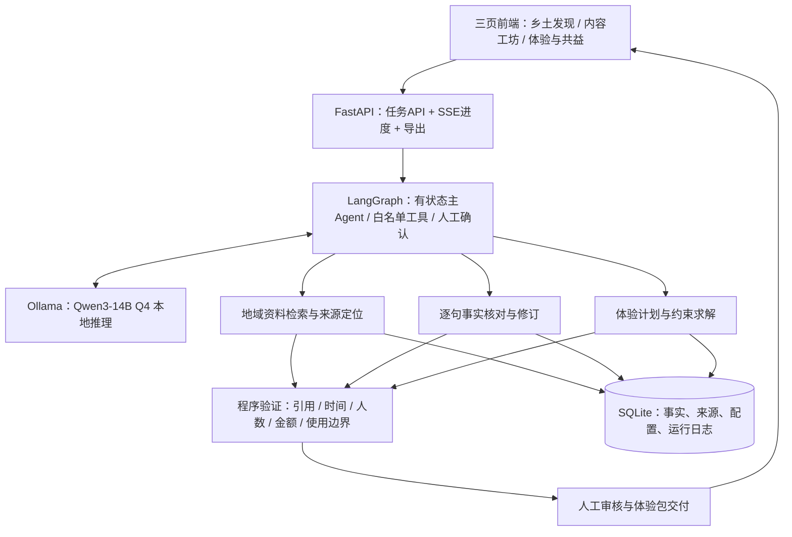

# 技术架构与验证方案

设计状态：2026-09-29。高保真前端原型已制作；以下后端、模型和业务Agent为待实现设计，尚未进行推理性能测试。

## 1. 免费、无需微调的选型

当前设备已读出RTX 5090、32607 MiB显存与约63.6 GiB系统内存。优先复用该电脑，不购买云GPU或模型API。

| 层 | 首版选型 | 作用与费用边界 |
|---|---|---|
| 主LLM | Qwen3-14B官方GGUF，Q4_K_M | 已训练好的中文通用模型，约9GB权重；不微调 |
| 降配LLM | Qwen3-8B官方GGUF，Q4_K_M | 约5.03GB权重；主模型体验不合适时比较 |
| 推理服务 | Ollama本地模式 | 本机HTTP服务，无模型API购买要求 |
| Agent | LangGraph OSS StateGraph | 免费开源编排库，直接嵌入后端，不使用收费平台 |
| 后端 | Python + FastAPI + Pydantic | 请求、流式任务事件、工具输入输出检查 |
| 检索 | 地域/项目过滤 + jieba分词 + BM25 | 小库先做透明可调的检索，无嵌入API |
| 可选向量检索 | 本地Qwen3-Embedding-0.6B | 只有检索评测证实需要时加入，不与主模型抢资源 |
| 存储 | SQLite + 本地文件 + JSONL运行记录 | 保存来源、事实、配置、任务与工具结果 |
| 计划与账本 | Python确定性规则、小规模枚举、整数分金额 | 不让LLM心算人数、价格和时间 |
| 正式前端 | React + TypeScript + Vite + CSS | 沿用当前原型的视觉，不依赖付费模板或组件 |
| 当前设计原型 | 独立HTML/CSS/JS + 自绘SVG | 可离线打开，尚未接真实模型 |

Qwen3官方GGUF模型为Apache-2.0；Ollama与LangGraph OSS为MIT。LangGraph库与LangSmith云平台是不同产品，本方案不需要LangSmith账户或付费部署。Qwen-Agent也支持本地端点，可作为替代框架，但首版不叠加两套Agent循环。[14B模型](https://huggingface.co/Qwen/Qwen3-14B-GGUF)｜[8B模型](https://huggingface.co/Qwen/Qwen3-8B-GGUF/tree/main)｜[Ollama许可](https://github.com/ollama/ollama/blob/main/LICENSE)｜[LangGraph概览](https://docs.langchain.com/oss/python/langgraph/overview)｜[Qwen-Agent](https://github.com/QwenLM/Qwen-Agent)

“开箱即用”指使用现成权重、推理服务和编排组件。非遗专用Agent仍需配置资料、提示模板、工具和验证器；不存在下载通用Agent后就自动拥有本地文化与经营知识的保证。量化是降低权重存储精度，不是微调或新增训练。

可以做到新增软件许可费与模型API调用费为零；电费、既有硬件折旧、资料整理及后续维护工时仍存在。当前未安装Ollama、未下载权重，不因方案设计产生模型服务账单。

## 2. 本地运行策略

主模型单并发，初始上下文8192 tokens，通过检索提供小段证据；不把整个资料库装进每次请求。正式运行时冻结模型文件及哈希、Ollama版本、提示词、资料库和规则版本。

约9GB仅为权重大小，不是总显存。上下文缓存、运行器和并发都会占用额外内存。14B在当前设备上的具体延迟仍需实测；32B不作为首版默认，以免把时间耗在大模型调优上。

Ollama默认本地端点127.0.0.1:11434，可用官方支持的`OLLAMA_NO_CLOUD=1`关闭云功能。服务仅绑定本地或经确认的演示局域网。关闭云追踪，设置`LANGSMITH_TRACING=false`且不配置云追踪Key；不接联网搜索、收费地图、在线TTS和付费嵌入服务。Ollama的开关不会阻止其他组件联网，完整离线能力仍需通过断网验收。[Ollama FAQ](https://docs.ollama.com/faq)｜[硬件支持](https://docs.ollama.com/gpu)

优先顺序：真实本地推理 → 明示缓存命中的真实历史结果 → 明示历史回放。网络或模型故障不能把预设案例伪装为当前推理。下载依赖、模型和资料后可离线演示。

## 3. 分层架构

见[总体架构SVG](../diagrams/system-architecture.svg)。

前端呈现可理解的阶段和工具结果；模型内部思维不作为用户界面内容。界面中的“已支持”“资料冲突”“需要确认”来自保存的审核状态，不能由前端随机生成。

## 4. Agent状态与工具

任务状态：

`接收需求 → 地域消歧 → 事实拆分 → 定向检索 → 证据判定 → 必要补查/追问 → 生成修订稿与候选体验 → 程序校验 → 有界修订 → 人工确认 → 导出`

来源或经营条件不足时，允许停在“待确认”，而不是强制生成一个看似完整的答案。初始调用预算建议最多8次模型调用、最多2轮修订，预算是可调整工程参数。工具内部模型调用、JSON修复和自动重试全部计入同一个预算。错误达到上限后返回可解释的中间结果，不无限自我反思。

| 工具 | 输入 | 输出 | 确定性检查 |
|---|---|---|---|
| resolve_entity | 项目名、地域描述 | 候选实体与歧义字段 | 同编号不同地区不能自动合并 |
| search_evidence | 实体ID、问题、时间范围 | source_id、片段、出处 | 地域/时间过滤和出处真实存在 |
| get_source_context | source_id、片段ID | 上下文与版本 | 不只截取支持结论的半句话 |
| assess_claims | 原句、候选证据 | 支持/矛盾/不足/冲突及说明 | 状态枚举、引用ID；语义正确性需评测 |
| get_operating_profile | 场景ID、日期 | 时长、容量、报价、限制 | 演示配置与真实配置分开 |
| solve_plan | 人数、时间、预算、活动池 | 可行候选或冲突集合 | 固定资源、无重叠、预算和容量 |
| calculate_ledger | 人数、已选活动、报价 | 分项费用、收款角色、比例 | 整数分求和、舍入、分母、总账一致 |
| validate_bundle | 事实、计划、来源、政策 | 逐条检查与待确认项 | 引用、硬约束、使用许可状态 |
| export_bundle | 指定版本及用途 | HTML/JSON，后续可加PDF | 内部草稿保留待确认项；对外版本执行使用限制 |

模型只能调用这些工具，不执行任意Shell/Python、自动发布、支付或预约。资料原文中的指令作为文本数据处理，不能更改工具权限。Ollama可提供工具调用和结构化输出；格式正确不代表语义已正确。[工具调用](https://docs.ollama.com/capabilities/tool-calling)｜[结构化输出](https://docs.ollama.com/capabilities/structured-outputs)

## 5. 数据模型

四类数据物理或逻辑分开：官方事实、素材与许可、演示经营配置、社区真实意愿。不得把一条演示价格引用到“官方事实已核验”卡片。

| 对象 | 关键字段 |
|---|---|
| HeritageEntity | entity_id、名称、项目编号、申报地区、地域范围、别名 |
| SourceDocument | source_id、URL、发布者、发布日期（可未知）、获取时间、内容哈希、使用范围 |
| EvidenceSpan | span_id、source_id、段落定位、必要摘录、地域、时间范围 |
| Claim | claim_id、原句、entity_id、类型、证据ID、审核状态、人工确认 |
| OperatingProfile | profile_id、is_demo、活动池、容量、时段、报价、费用承担与收款角色 |
| CommunityPolicy | 署名、禁拍/禁公开、同意状态、有效期、撤回状态 |
| PlanTask | 受众、人数、时间窗、预算、地域、必要需求、可调整条件 |
| ExperienceBundle | 内容版本、讲解卡、活动表、账本、约束报告、来源清单、未确认项 |
| AgentRun | run_id、模型/提示词/资料版本、工具输入输出、调用次数、耗时、缓存/回放状态 |

SourceDocument的获取日期不等于发布日期；两者不能混写。一个文化项目编号不是全球唯一地域实体ID。内容更新通过来源哈希找出受影响事实与体验卡，触发定向复核，保留旧版本。

## 6. 精确计划与经济计算

首版限定一个演示场地、三项活动，提供轻体验90分钟与深体验120分钟两种均可合法成立的组合，程序枚举少量组合/顺序即可。P1再扩展多场次或第二场地。地图不是必要条件，未知移动时间不能默认为零；当前原型仅因显式假设同场地才不计移动。

硬约束示例：人数≤场次容量；活动总时长＋已知移动时间≤可用时间；人均费用≤预算；活动时段不冲突；不包含禁拍/禁公开内容。限制必须带来源或“演示配置”标记。

首版可选偏好：更低预算、更长学习体验、更多本地服务支出。这些偏好只对已经满足硬约束的候选排序；花费更多不自动等于社会效果更好，由用户选择。首版同场地不做“更少移动”排序。LLM不能自己制定公平分成或解除文化禁忌。

原型账本公式：

`本地服务毛收入 = 300 + 35n + 20n`

`材料与工具 = 100 + (复用时10，否则16) × n`

`总支出 = 本地服务毛收入 + 材料与工具 + 160`

`本地服务收入占比 = 本地服务毛收入 / 总支出`

默认n=8时总1080、本地服务740、材料180、组织160。实际产品使用金额分存储，显示时统一舍入。交通、税费、住宿等不在该示例中，导出时保留范围说明。服务毛收入不能写成利润或净增收。

轻体验对照：讲解20＋手作50＋茶歇20分钟；本地服务=200＋25n＋15n，材料=80＋（复用8，否则14）×n，组织=120。8人复用时总784、本地服务520、材料144、组织120。两种方案在默认条件下均合法，可比较教学时长、费用、本地服务支出和演示纸材用量（轻1份/人，深2份/人）。材料份数是配置假设，不是测得的生态改善。

导出分两种用途：内部草稿可包含明确标注的待确认项；对外使用版本排除禁公开、已撤回和许可待确认的受限素材，以可用的公开资料或待补占位替代。整个包存在未确认场地/经营条件时不能标记“已获授权可执行”。这一规则不要求先取得合作，但会改变输出状态。

## 7. 前后端接口草案

| 接口 | 用途 |
|---|---|
| GET /api/cases | 主专题、演示案例与状态 |
| POST /api/tasks/audit | 提交文稿、地域和受众，返回task_id |
| GET /api/tasks/{id}/events | SSE阶段、工具结果、需要用户补充的字段 |
| POST /api/tasks/{id}/clarification | 用户确认地域或允许调整条件 |
| POST /api/tasks/plan | 体验需求与经营配置版本 |
| GET /api/sources/{id} | 来源、片段上下文、获取时间 |
| POST /api/bundles/{id}/review | 人工接受/修改/保留待确认 |
| GET /api/bundles/{id}/export | 下载体验包和出处清单 |

所有任务保存输入快照。非法模型JSON最多修复一次，仍失败则返回明确失败状态；引用不存在时不能导出为已核验内容。来源页面失效时可显示本地合法留存的版本及获取日期，不谎称已实时访问。

## 8. 数据与实验设计

建议目标：15—25份相关官方资料，80—120条带出处事实，20道开发任务＋60道冻结测试任务。数量是项目规划，不是已完成记录；小团队可缩小规模，但不能用重复改写冒充独立文化案例。

测试分为事实审校20、约束计划20、综合任务20。包含正确文本、地域混淆、缺少地域、资料不足、来源冲突、经营条件无解、预算和容量边界。人为注入错误与真实文本问题分别报告。正式答案由独立人工核对及确定性约束程序给出，不能只让同一LLM给自己评分。

测试文稿/模板/任务不进入调提示词过程；同源近似改写归组。评测允许检索知识库中的公开资料，因为这正是任务输入资源，但答案标签和判定备注不能混入检索库。

| 组别 | 配置 | 解释用途 |
|---|---|---|
| B0 | 同模型、同资料的一次生成 | 显示普通生成的能力与限制 |
| B1 | 地域过滤→检索→审校→同一求解器→同一验证器→固定修订 | **主要强基线**，具备合理工具和修复预算 |
| A | 根据缺口与冲突动态选择工具的完整Agent | 检验自适应编排的额外价值 |

B1与A使用相同模型、资料快照、工具权限、可查询数据和最大调用预算。报告相同预算下的质量，以及相近质量下的调用量；不能把B1不准使用验证器造成的差距归为Agent贡献。

两个必要消融：取消主动追问/补查；取消证据与地域约束。其余组件保持一致。

优先报告五组指标：

1. 来源不支持的事实比例及证据支持率，明确事实单位与分母。
2. 错误检出/修订F1，配合对正确内容的误改率。
3. 整个任务全部硬约束满足的比例，配合无解任务正确识别率。
4. 统一量表下的完整任务成功率，人工盲评并记录分歧。
5. 制作/复核时间、模型调用次数、token数和本地端到端延迟。

服务收入、材料成本与生态约束结果另列为场景试算，不混进“实际增收/减排”。小样本报告数量、配对结果和不确定性，不填写尚未测得的提升百分比。

## 9. 启动验收与降级

先完成三件事：本地14B产生可解析结果；在真实来源上完成最小查证；程序能识别预算/容量冲突。再接漂亮前端，保持每一张结果卡对应真实后端状态。

若14B速度不合适，比较8B、缩短上下文、预热模型和减少无效轮次；若8B质量下降，就优先保留较慢但可靠的少量核心功能，不能只为动画流畅牺牲事实。

若Agent不优于B1，诚实报告适用场景、代价和失败类型，收缩算法主张。若文化事实核验不可靠，暂停自由生成，先交付有来源模板与人工确认工具。设计目标仍是完成有证据的参赛作品。
