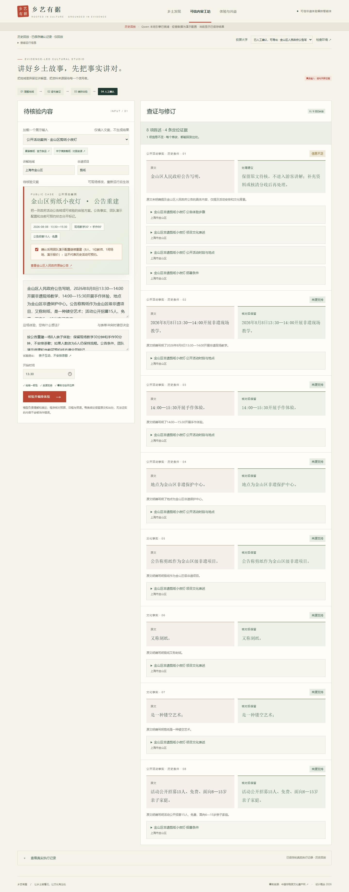
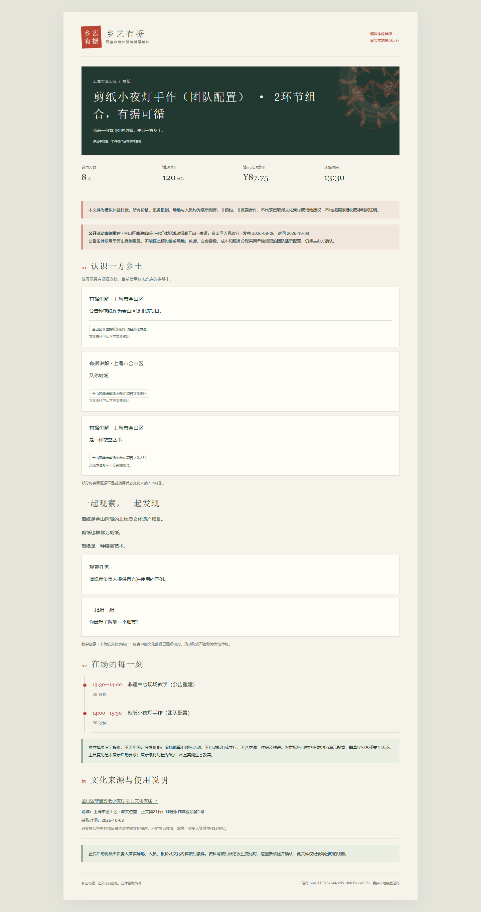


# 公开活动案例：金山区剪纸小夜灯

## 选择结论

本轮只接入一个外部案例：**金山区非遗剪纸小夜灯体验活动招募开启**。原始页面来自金山区人民政府，发布于2026年8月6日，访问日期为2026年10月3日：[查看原始公告](https://www.shanghai.gov.cn/nw17239/20260806/ab8799763c384e7eb1b254cebf1e0cf5.html)。选择理由是字段相对完整，能同时看到活动时段、地点、招募对象、名额、费用和简短文化描述，适合在既有剪纸闭环中展示“公告事实—演示资源—可交付方案”的边界。

有限候选核对如下：

| 候选原始页面 | 已看到的字段 | 取舍 |
| --- | --- | --- |
| 金山区人民政府·剪纸小夜灯（2026-08-06） | 时段、地点、招募15人、免费、6—15岁亲子、项目简述 | **选定**；可检验总时长、手作时长、名额与容量的区别 |
| 烟台市文化馆·非遗剪纸公益体验（2024-09-30） | 时间、地点、课程内容、对象 | 未接入；缺少本案例所需的容量和经营边界 |
| 虹口区政府·剪纸课程活动信息（2026-05） | 时间、地点、教师、步骤 | 未接入；没有完整招募/成本字段 |
| 丰台区政府·非遗剪纸系列活动（公开活动页） | 系列安排、报名人数等 | 未接入；与当前地域、单场手作叙事的字段不如选定页面贴合 |

## 原始公告事实

来源记录存放在 `data/curated/public-case-sources.json`，每条摘录保留来源 URL、发布机构、发布日期、访问日期和正文位置，并保存摘录 SHA-256。已保存的是必要短摘录和元数据，不复制网页全文、图片或报名二维码。

- `src-jinshan-public-schedule`：公告写明8月8日13:30—14:00非遗现场教学、14:00—15:30非遗手作体验，地点为金山区非遗保护中心（吕巷镇干溪街258号）。定位：正文第8—20行。
- `src-jinshan-public-recruitment`：公告写明活动时间13:30—15:30、招募15人、免费、对象为6—15岁亲子家庭。定位：正文第31—45行。
- `src-jinshan-cultural-fact`：公告写明剪纸作为金山区级非遗项目，又称刻纸，是一种镂空艺术。定位：正文第21行手作体验段第1句。
- `src-jinshan-public-process`：公告描述从构思图案到动手操作、亲手完成作品。定位：正文第21行手作体验段末句。

“非遗时光印记”段落出现与主活动日期不一致的时间信息，已作为待核对事项保留，没有被编入当前可执行方案。

## 边界与重建条件

| 分类 | 本案例当前使用内容 |
| --- | --- |
| 公开资料明确事实 | 2026-08-08、13:30—14:00现场教学、14:00—15:30手作、金山区非遗保护中心、招募15人、免费、6—15岁亲子、公告中的剪纸简述 |
| 团队演示配置 | 8人、单组容量8人、1位教师、教师容量8人、1间场地、纸材每人1份、演示报价与服务分账、可用120分钟；全部标 `is_demo=true` |
| 仍需主办方确认 | 当前能否预约、真实安全容量与疏散要求、授课人员及授权、成本/服务报酬/材料用量、场地使用许可，以及公告日期分歧 |

报名名额不是安全容量；活动持续时间不是每道工序时长；免费不是运营成本为零；历史公告不是当前预约资源。游客版不把历史招募条件排成当前承诺，组织者版保留来源与边界。

## 真实运行与变化

主运行 `bb6c113f76a544cb951d6ff15dd4323c`（本地 Qwen3-14B Q4_K_M，版本1，7次模型调用，22.756秒）在确认演示配置后完成：模型拆分并核验8条陈述，程序选中“现场教学30分钟 + 剪纸小夜灯手作90分钟”，同场地顺序安排13:30—15:30；8人总演示支出702.00元，人均87.75元，本地服务演示毛额436.00元。金额、时长、容量和资源均可由组织者版账本复算。

- 人数改为6人的运行 `ba7f49c58bf6487bb183935b18e34c2c`：方案仍保持必要时长，材料按人数和本地服务按人数变化；结果作为前后比较记录。
- 可用总时长改为110分钟的运行 `9b150f160e4e4e2ab767b11b3d51cf3a`：状态为 `needs_input`，明确指出两个候选分别需要120/130分钟，不能虚构压缩必要环节。
- 同输入固定流程对照 `d2d1c8b3e83c4498911341b07d95c05c`：使用同一模型、来源、经营快照和工具，但关闭Agent的阻断复核后，在“公告条件、团队演示资源和当前可预约状态请分开标记”处停在 `needs_input`（2次调用、5.782秒）。这说明本次对照只记录流程差异，不构成等算力或效果优越结论。
- 首次外部案例运行 `f8cac4a4287e4e0d8909d2996f600dfe` 因把现场教学30分钟与手作90分钟误判为同一手作约束而停止；随后加入“现场教学/讲解属于非手作阶段”的确定性作用域规则，修复后复跑。首次失败保留，不用成功结果覆盖。

这一组是同资料、同工具条件下的本机案例验证，不是独立第三方评测；成功精选用于展示，失败和阻断记录同时保留。

## 交付入口

- [游客版体验包](jinshan-visitor-bb6c113f.html)：短讲解、观察任务、互动提问和120分钟日程。
- [组织者版体验包](jinshan-organizer-bb6c113f.html)：账本、教师/场地/容量、来源定位、教学扫描和使用边界。
- [案例演示讲稿](../../demo/external-case-demo-script.md)
- [公开来源数据](../../../data/curated/public-case-sources.json)
- [演示经营配置](../../../data/operating/jinshan-reconstruction.json)

关键截屏：

- 
- 
- 
