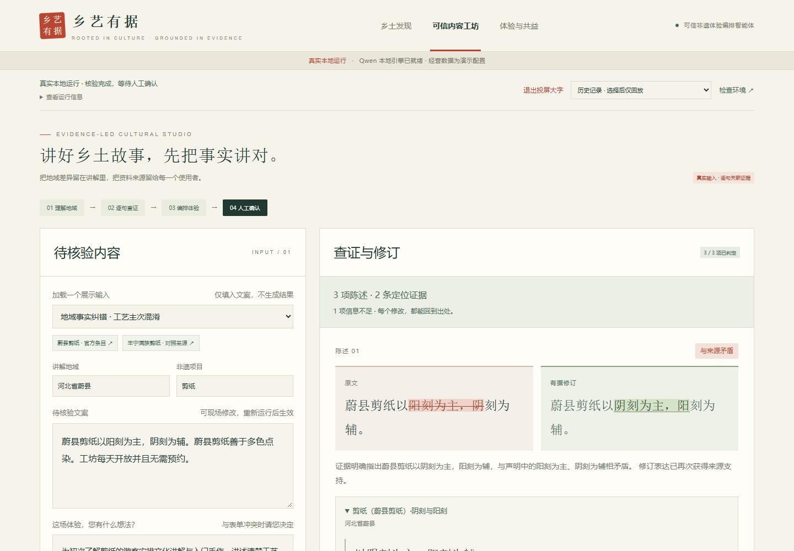
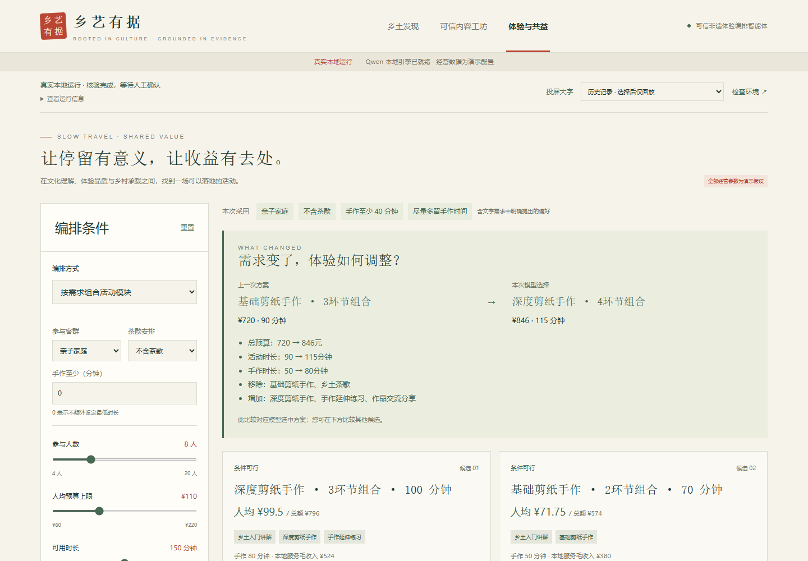
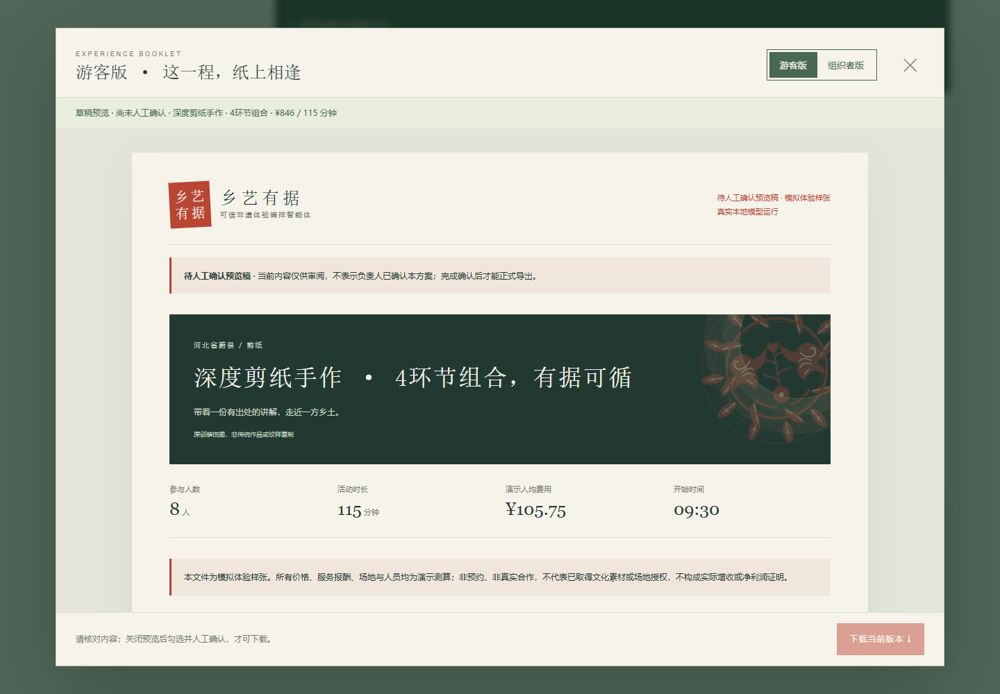

# 八模块编排与投屏展示升级实测

日期：2026-09-30。基于`4db6bfd`继续开发，沿用原三页、Qwen3-14B Q4_K_M、Ollama、LangGraph、FastAPI及SQLite。本报告区分程序测试、真实现场流程和未用于调试的小规模内部验收。没有独立评测、真实经营合作或获奖结论。

## 直接看到的变化

原文与有据修订并排展示，朱红/墨绿标出差异；第一条定位证据直接展开，运行细节折叠。真实运行、回放、演示数据标识仍可见。

人工选择的基线为8人、720元、90分钟、手作50分钟并含茶歇。将表单预算改为110元/人，再写“安排亲子互动，不安排茶歇，手作至少40分钟，多留手作时间；讲解浅显易懂”，系统先显示客群/茶歇与表单冲突；明确采纳后重新调用模型，选择846元、115分钟、手作80分钟的新组合。茶歇实际移除，增加手作延伸和交流。预算上限880元；更少的预算上限不意味着必须比原低价基线支出更少，本次增加手作后的支出仍在上限内。所有数值均是演示测算。

预览由服务端从当前可行候选排版，明确“待人工确认”。正式下载还检查确认方案、来源/素材版本、整数分账目、日程和教学快照。游客版加入短讲解、观察与提问；组织者版保留引用、原文修订、账本与接待资源。教学创意另标，不能作为文化事实免审理由。

静态导出样张：[游客版](experience-packs/module-visitor.html) · [组织者版](experience-packs/module-organizer.html)。二者是素材撤回后重新执行、确认得到的真实输出，非活动订单；下载文件不会随系统状态自动变化。

## 真实浏览器验收

同一台RTX 5090、仓库隔离环境和官方模型，原模型哈希及安装证据见[旧版报告](local-runtime-2026-09-30.md)。本轮没有换模型、微调、付费API或收费追踪。以下五个任务均由浏览器真实操作触发，API响应未mock；确认由自动化模拟用户点击，只证明确认闸门，不是实际经营人员审核。

| 任务 | 结果 | 模型调用 | 本机耗时 |
| --- | --- | --- | --- |
| 地域纠错、模块求解、一般游客教学 | 待审；人工选基线后确认 | 7 | 12.517秒 |
| 文字亲子/不茶与原表单冲突 | `needs_confirmation`，不能预览/下载 | 2 | 2.365秒 |
| 采纳文字并按预算110重编排 | 846元/115分/手作80分，教学通过 | 7 | 12.618秒 |
| 撤回原创装饰素材，重新核验并确认 | 新包不含撤回SVG，两版内容有效 | 7 | 12.657秒 |
| 16人、容量8、1教师/1场地 | `needs_input`；没有虚构拆组或并行 | 4 | 4.845秒 |

共27次模型调用。前三个完整交付任务约12.5—12.7秒，均为本机小样本暖启动结果，不是速度承诺。最终有效记录`8a8d61a8b4b24b52a8cfad4c14e7571f`；其素材快照已不依赖撤回项，恢复素材后再实际GET，两版仍返回200。旧确认在撤回时已取消，不能靠恢复状态复活。

1440与390宽度的三页、双版预览及实际下载均无横向溢出；0条JS错误、0条外部HTTP页面资源请求。后者不等于整机离线验收。完整逐项检查见[浏览器记录](upgrade-cases/ui-verification.json)，截图还包括[教学卡](../assets/screenshots/upgrade-teaching.png)、[冲突选择](../assets/screenshots/upgrade-conflict.png)、[手机游客包](../assets/screenshots/upgrade-visitor-mobile.png)。

另外用当前代码真实执行旧套餐回归：160元预算选择1080元/120分钟深体验（3次调用、2.230秒）；110元预算选择784元/90分钟轻体验（3次、1.977秒）。[原始记录](upgrade-cases/legacy-summary.json)。旧套餐入口没有启用新增教学，不能拿其耗时代表完整新版流程。

## 一次性内部验收：2项符合预期，4项未完全通过

输入由同一协作团队的另一执行者预先编写，未调用模型调试；根执行者在实现与提示冻结后首次读取，六条各运行一次。输入SHA-256为`1ef11ff553f4388d39b5dac64f0b0fea137b2aade00375a25651d3d187c0ca70`。[输入](../../tests/acceptance/upgrade-holdout.json)、[冻结文件哈希](upgrade-cases/freeze-manifest.json)、[逐项结果](upgrade-cases/holdout-summary.json)均保存。没有依据这六条继续修改提示或重测抹去失败。

| 用例 | 首轮结果 | 具体含义 |
| --- | --- | --- |
| UH-01 换说法：省掉喝茶、动手时间给足 | 未通过 | 偏好与事实均识别正确，但模型连续选择未最大化手作的候选；两轮修订后程序阻断交付。不是教学检查失败。 |
| UH-02 复合文化事实+授课承诺 | 未通过 | 模型把“无依据承诺保留待确认”误作需求歧义，提前停止；原文独立事实粒度也未达到期望，不能声称完成复合句逐项核验。 |
| UH-03 中文数字与表单人数/预算/时长冲突 | 通过 | 正确列出12人、80元、100分钟与表单冲突，未自动替换，等待确认。 |
| UH-04 固定套餐不要茶歇且手作至少70分钟 | 通过 | 两套餐均无解；保持784/1080元与90/120分钟，不删环节冒充可行。 |
| UH-05 十人亲子、制作满一小时 | 未通过 | 手作60分钟识别正确，却同时误识别为总时长60分钟，产生不必要的确认。 |
| UH-06 同时接待16人且无额外资源 | 未完全通过 | 安全停止且未改人数/资源，但把资源限制误作歧义，没进入求解器给出应有的容量/教师冲突。 |

这六条合计17次模型调用，全部未获人工确认，直接下载均被拒绝。**保护规则生效不等于任务成功**；2/6是内部预期逐项符合数量，不发布为准确率，也不是独立泛化评测。下一步优先修复语义歧义、细粒度复合句和偏好选择稳定性，不能靠重命名状态美化失败。

## 开发中保留的真实失败

- [第一次教学扫描失败](upgrade-cases/regional-dev-1.json)：扫描同时输出`no_new_fact`和文化前提，程序拒绝；随后强调开放观察及逐项前提，未放松出口。
- [空备注误添偏好](upgrade-cases/regional-dev-2.json)：旧提取错误填入亲子/不茶，产生假冲突。现在空备注不请求偏好推断，使用明确空意图；模型仍真实拆解文化文案。[随后成功记录](upgrade-cases/regional-dev-3.json)仅代表当时开发版本。
- [默认文字误报信息缺失](upgrade-cases/ui-failed-default-note-857dfe88.json)：旧模型要求文字重复表单预算、时长及资源。随后将文字提取拆成单独请求，并限定为茶歇三态、手作时长、客群和数字等业务字段。对任意活动硬增删不做通用理解承诺。
- 五次单请求偏好提取诊断也保存为`intent-*-diagnostic.json`。形式上合格的JSON曾误填多个模块；尝试思考开关没有解决问题，最终继续`think=false`。最终每次请求同时提供schema约束和提示字段定义，符合[Ollama官方结构化输出建议](https://docs.ollama.com/capabilities/structured-outputs)，但这不能保证语义正确；上面的冻结失败就是现实边界。
- [基线选择测试断言失败](upgrade-cases/ui-baseline-selection-harness-failure.json)：一次真实默认任务本身成功，但候选未含测试期望的50分钟手作+茶歇。没有改程序答案；测试随后在真实表单明确选择需要茶歇，重跑完整场景。保留[原成功快照](upgrade-cases/ui-default-neutral-success-69898a50.json)。

## 程序、来源及提交材料边界

- 178项后端单元/契约测试通过；包含假模型与隔离SQLite，不计为真实推理效果。原三页`npm test`通过，新增`npm run test:modules`完成上述真实浏览器验收。
- 8模块配置可枚举64个结构合法组合，锁定报价、必要时长、互斥/依赖、教师和场地；模型只选择程序候选。所有支出、服务报酬和纸材数量都是演示假设，不能当净增收或生态改善实测。
- 文化库由2页6片段扩充至4页12片段，旧ID和版本不覆盖。新增官方资料见[来源核对](curated-sources-expansion-2026-09-30.md)。文化公开事实不等于图片、场地或商业服务授权。
- 已读用户《参赛指南》和3个DOCX模板，核对匿名、源码证明、章节与字数上限。后续交件约束见[附件核对](../development/competition-submission.md)；本轮未代填身份、提交报名或修改仓库可见性。当前公开仓库与首次发表条款的适用关系仍待核实。
- 真实经营人员复核、正式独立评测、强基线比较、整机断网及正式参赛文档尚未完成。当前成果适合展示受控的小规模业务闭环，不宣称通用非遗知识系统或比赛名次保证。
